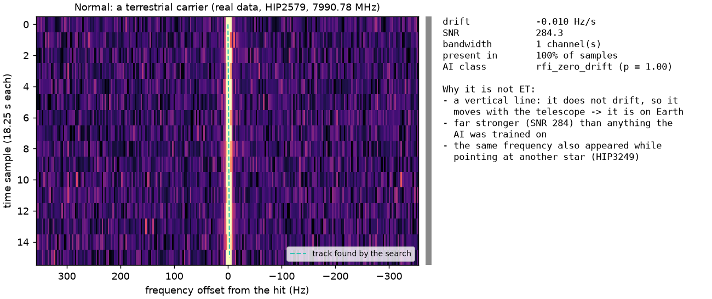
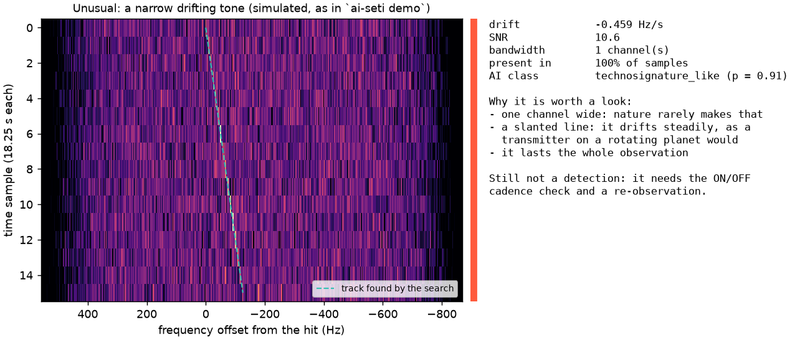

# AI-SETI v0.3 — parallel, AI-assisted technosignature search

In the spirit of SETI@home: your computer downloads small pieces of real radio-telescope
data, searches them for narrowband signals that drift like a transmitter on another
planet would, and keeps a running tally of the best signal it has ever found.

> Candidates are statistical detections. A real technosignature claim needs an ON/OFF
> cadence pass, independent re-observation and a lot of humility.

See [ARCHITECTURE.md](ARCHITECTURE.md) for module responsibilities and data flow,
[implementationplan.md](implementationplan.md) for the change log, and
[backlog.md](backlog.md) for known defects and deferred work.

## Data: where the work comes from

SETI@home stopped distributing work units on 31 March 2020 and has been hibernating since.
`ai-seti crunch` checks the SETI@home server status on every start and tells you if it
ever wakes up. Meanwhile it auto-loads from the **Breakthrough Listen Open Data archive**
(Berkeley SETI Research Center, the same group): `.fil` files are streamed per work unit
with HTTP Range requests (a 4 GB file is never downloaded whole); `.h5` files are cached
with a size guard.

## Install

Requires Python 3.11–3.13.

```bash
python3 -m venv .venv && source .venv/bin/activate
# add ,dashboard for Streamlit; ,gpu for CuPy (experimental)
pip install -e ".[radio,dev]"
```
blimpy/turboSETI are no longer required (optional `[compare]` extra for cross-checks).

> `pip install -e ".[compare]"` only. If you installed a scikit-learn outside the
> `>=1.8,<1.9` window in [pyproject.toml](pyproject.toml), the bundled
> `hit_classifier.joblib` will not unpickle. AI-SETI tells you when this happens
> (`model_unavailable` in the candidate table, plus a banner in `report.html`) instead of
> quietly reporting every hit as `unscored`. Rebuild the model with `ai-seti train`.

## Development and quality gates

```bash
# run the tests
pytest
pytest --cov=ai_seti --cov-report=term-missing
# lint
ruff check .
# typecheck (configured in pyproject.toml)
mypy
```

CI (`.github/workflows/ci.yml`) runs lint, typecheck and tests on Python 3.11, 3.12 and
3.13, enforces a 60% coverage floor, and adds a smoke job that asserts the bundled
classifier loads, `demo` produces a report with real AI classes, and `share` writes a
bundle.

## How to use this

Three steps: install it, point it at some data, read the report. You can stop after any of
them, and nothing is sent anywhere unless you explicitly ask for it.

### 1. Try it on data it makes up

```bash
ai-seti demo
```

This builds a fake radio observation — a GBT-like coarse channel with **3 signals hidden in
it** plus 60 pieces of interference — searches it, and writes a report. The three hidden
signals should come back ranked #1, #2 and #3, all labelled `technosignature_like`. Nothing
is downloaded and nothing leaves the machine.

### 2. Point it at real data

Pick whichever fits:

```bash
# a file already on disk
ai-seti analyze data/raw/obs.fil
# a URL, streamed not downloaded
ai-seti analyze https://example.org/obs.0000.fil
# fetch new BL observations, keep going
ai-seti crunch --target HIP --max-units 8
```

`analyze` searches one file, once. `crunch` is the SETI@home-style loop: it asks the
Breakthrough Listen archive for work, processes everything it has not seen, and remembers
what it already did in `data/state.json`. `--max-units N` caps each observation at N units
per run; the next run continues at the next channel, and an observation only counts as done
once every channel has been searched. Half of each run's `--limit` slots go to files not
started yet, so new targets keep arriving while big files are worked through.

What a file costs: a high-resolution `.0000` product is ~1 billion channels × 16 samples of
float32, **64 GB** per scan. AI-SETI streams only the channels it searches, but the archive
link measured ~7–8 MB/s, so a whole file takes **~2 hours**. One work unit (262,144 channels)
is 16 MB. `--forever` therefore defaults to `--max-units 128` (~2 GB, ~4–5 min per visit);
without `--forever` a file is searched whole unless you set `--max-units`. Analysis is ≤ 5% of
the time; the rest is download, which is why the cadence check (6 scans) costs ~6×.

`crunch` skips files it cannot usefully search, and records why in `data/state.json`:
mid-resolution products (`.0002`), whose channels are too wide to measure drift (use the
`.0000` file of the same scan, or `--include-unresolvable`), and high-time-resolution products
(`.8.0001`), which are pulsar data and would need ~26 GB per work unit. `--retry-failed`
forgets recorded failures after an update.

Without a terminal (or with `--no-live`) `crunch` prints plain status lines instead of the
live dashboard: `Pass 2 · file 3`, how many units and MB it is about to fetch, then per unit
how long the download and the analysis took and the MB/s, the cadence scans it is
searching, and at the end of each pass the files, MB and average speed.

After each observation `crunch` prints, besides the top-candidates table, a plain summary:
how far through the file this run got, how many signals rose above the noise, why each one was
set aside (receiver artefact, seen at another star, doesn't drift, interference-shaped, …;
each signal counted once, under its strongest reason), and a one-line verdict.

Before hunting for aliens, it is worth checking the file you have is sane:

```bash
# header only: size, sample rate, channel width, source
ai-seti inspect data/raw/obs.fil
```

### 3. Read the report

Each run writes a folder — `reports/demo`, `reports/analysis` or `reports/crunch` by default:

| File | What it is |
|---|---|
| `report.html` | **Start here.** Animated 3-D power plot plus the ranked candidate table. |
| `candidates.csv` | Every hit, one row per signal, ranked by interest score. |
| `spikes.csv`, `pulses.csv` | Single-sample spikes and dispersed pulses. |
| `band_overview.png` | Where in the band the power sits. |
| `metadata.json` | Config, package versions and timings for this run. |

The single number that ranks candidates is **interest**, 0–100. It blends how ET-like the
signal looks, its SNR, and how unusual it is against every other hit in the same run.

## What the search looks for

### The idea in one paragraph

A radio telescope records power at millions of narrow frequency channels, over and over in
time. The result is a *waterfall*: frequency across, time down. Almost everything in it is
noise, the receiver itself, or human transmitters (satellites, radar, phones, aircraft).
AI-SETI looks for the one kind of signal nature is not known to make: a **tone only a few Hz
wide that slides slowly in frequency**, because the transmitter sits on a moving, rotating
world. Everything else in the pipeline exists to throw out the many things that look a bit
like that.

### What a technosignature would have to look like

A signal only stays on the list if it passes every test below. Each test rules out a common
impostor.

| Property | Why it matters | How AI-SETI checks it | Impostor it rules out |
|---|---|---|---|
| **Narrowband** (one or a few channels, ~3 Hz each) | No known natural process makes Hz-wide tones; the narrowest natural lines (masers) are hundreds of Hz wide. | `bandwidth_ch`, wide hits (> 8 channels) lose 60% of their score | broadband interference, natural emission |
| **Drifts** (non-zero `drift_rate_hz_s`) | A transmitter on another planet accelerates relative to us, and its frequency slides. A transmitter on Earth moves *with* the telescope and stays put. | Taylor-tree de-Doppler search over ±4 Hz/s; `stationary` (at most one channel of drift over the whole scan, which is within the noise) costs 70% of the score and blocks sharing | ground transmitters, the receiver's own tones |
| **Steady** (present all through the scan) | A beacon should be there in every sample, not flicker. | `on_fraction`, `modulation`, `wobble_rms` | intermittent and frequency-hopping interference |
| **Only at the target** | A signal from a star is only seen when the telescope points at that star. | Same frequency, or a busy band, already seen at *another* star → `multi_target`; the ON/OFF cadence (`cadence = failed` cuts the score to a fifth) | anything picked up through the side of the beam |
| **Not an instrument artefact** | GBT coarse channels make mirror copies of strong tones around each channel centre. | `mirror_pair`, `mirror_image` (score cut to a fifth) | the receiver's own spectral images |
| **Outside known interference bands** | GPS, Galileo, Iridium, Inmarsat and others own fixed bands. | `known_rfi_band` (score halved) | satellites |
| **Plausible strength** | Strong, steady, slowly drifting tones are almost always nearby transmitters. | the AI's `rfi_strong_carrier` class; beyond 3× the strongest training signal, `out_of_distribution` (score cut by 70% and capped at 50) | strong terrestrial carriers |

**What the drift tells you.** Drift is acceleration along the line of sight:
`a = c × drift / frequency`. Earth's own rotation gives about 0.03 m/s², which is about
**0.9 Hz/s at 8 GHz**. The default ±4 Hz/s limit covers accelerations up to ~0.15 m/s² at
8 GHz (more at lower frequencies), which is the range expected for transmitters on planets.

### Normal vs unusual: two examples

These figures are the raw waterfall around a hit (`docs/make_figures.py` regenerates them).
Frequency runs from high to low, left to right, as in the data files.

**Normal: interference.** A real carrier from Breakthrough Listen data (HIP2579, 7990.78 MHz).
A vertical line: it doesn't drift, so it is on Earth. It is ~280× the noise and turned up
again while pointing at another star.



**Unusual: what the search is built to find.** A one-channel tone that drifts steadily.
**This one is simulated** (the `ai-seti demo` injection). No real one has ever been
confirmed, by AI-SETI or anyone else.



The terminal says the same thing in words after every observation. A real search, where
everything had an ordinary explanation (`ai-seti crunch --target HIP --max-units 8`, HIP2586):

```
Seen: 135 signal(s) above the noise. Set aside:
     49  seen (or in a band busy with signals) at another star, so not from this one
     22  do not drift, so almost certainly transmitted from Earth
     64  shaped like interference, according to the AI
Verdict: nothing here needs follow-up; everything has an ordinary explanation.
```

A synthetic file with a hidden ET-like tone (`ai-seti crunch --source synthetic`):

```
Seen: 45 signal(s) above the noise. Set aside:
     27  do not drift, so almost certainly transmitted from Earth
     17  shaped like interference, according to the AI
Verdict: 1 signal(s) passed every automatic check. Best: 1419.887255 MHz, drifting
+1.582 Hz/s, interest 87/100. Still unverified until an ON/OFF cadence check and a
re-observation.
```

### Step by step, for one observation

1. **Split.** The file is cut into *work units* of 262,144 channels (~0.73 MHz on high-res
   data), each padded by the channels a drifting tone can reach.
2. **Clean.** The bright spike at each coarse-channel centre is repaired, the receiver's
   bandpass ripple is divided out, and every block of channels is scaled to unit noise.
3. **Search.** A Taylor-tree de-Doppler search adds up power along every straight line in the
   waterfall, from zero drift to the limit, both directions. Lines that rise above **SNR 10**
   become hits. A one-sample spike search and a dispersed-pulse search (the SETI@home and
   Astropulse ideas) also run. Spikes that are just samples of a tone already found are
   dropped; the rest, and any pulses, are counted in the summary and listed in `spikes.csv`
   and `pulses.csv`. A pulse without dispersion is marked as terrestrial.
4. **Describe.** Each hit gets physical features (width, steadiness, wobble, side-lobes, …)
   and a small de-drifted image of itself.
5. **Judge.** The AI classifies each hit (see [the AI part](#the-ai-part-and-how-it-works-with-the-search)),
   the anomaly detector rates how unusual it is in this run, and the flags above are set.
6. **Score.** `interest` (0–100) combines all of it. The terminal summary, `report.html` and
   `candidates.csv` are written, and the ledger is updated.

The technical one-screen version is [How a work unit is processed](#how-a-work-unit-is-processed).

**What a high score is not.** Interest is a ranking, not a probability of ET. `crunch`
runs the strongest test, pointing away and back (the ON/OFF cadence), automatically when it
processes the *target* scan of an archive cadence. It searches the same channels in the other
five scans, and each hit's `cadence` column says `passed`, `failed`, `untestable` (an OFF
pointing, or too few scans) or `not_run`. A pass still needs a re-observation.

## Where unusual signals end up, and how to report them

Every observation gets its own folder under `reports/` (`reports/crunch/<file>` or
`…/<file>_ch<start>-<stop>` for a partial run, `reports/analysis`, `reports/demo`):

| File | What is in it | Use it to |
|---|---|---|
| `report.html` | The top candidates, with a plain-language "why it scores this" for each and a 3D view of the best one | look first |
| `candidates.csv` | **Every** hit, one row each: `frequency_mhz`, `drift_rate_hz_s`, `snr`, `interest`, `ai_class` and `p_*` probabilities, `anomaly`, and the flags `stationary`, `drift_unresolved`, `known_rfi_band`, `mirror_pair`, `mirror_image`, `multi_target` | sort, filter, check |
| `metadata.json` | Config, software versions, file header, the drift range actually searched, timings, AI warnings | reproduce the run |
| `band_overview.png` | The whole searched band at a glance | spot crowded regions |
| `spikes.csv`, `pulses.csv` | Lone single-sample spikes (not part of any tone) and broadband pulses, with `likely_rfi` for undispersed ones | check a short burst |

An **unusual signal** is a row with `ai_class = technosignature_like`, a high `interest`, and
none of the flags set. The terminal verdict counts exactly these ("N signal(s) passed every
automatic check") and names the best one, so you don't have to open the CSV to know whether
there is anything to look at.

`data/state.json` (the ledger) remembers across runs which files are done or half done, which
failed, the lifetime best signal, and the frequencies seen at each star. That list is what
makes the "seen at another star" flag work.

**Reporting back.** `ai-seti share <report folder>` turns the top candidates into
`ai-seti-finding/1` records. Each one has a stable ID (same file, frequency and drift → same
ID), a checklist, a de-drifted image and a SHA-256. It first runs the same gate as above:
zero-drift, RFI-band, mirror-image and seen-elsewhere signals never leave the machine. Then:

* without options, a local bundle: `reports/share/<finding_id>.zip` with
  `finding.json`, `finding.md` and `finding.png`, ready to attach to an email;
* `--to github --repo owner/name --yes` opens one issue per finding (duplicates are linked,
  not re-filed); `--to webhook` posts to Slack, Discord or any JSON endpoint;
* remote destinations only accept findings that **passed an ON/OFF cadence** unless you say
  `--no-require-cadence`, and the ledger never sends the same finding to the same place twice.

Details and every option: [Sharing findings back](#sharing-findings-back).

## The AI part, and how it works with the search

**Two different jobs.** The non-AI part *finds* signals and measures them. The AI part
*judges* what was found. The AI never searches the waterfall itself: it sees only the
features and a small image of hits the search already made. It can't add a hit or remove
one; it only changes labels and the order of the list.

| Question | Answered by | How |
|---|---|---|
| Is there a narrow line in the data, and how does it drift? | **search** (deterministic) | bandpass removal, Taylor-tree de-Doppler, SNR threshold |
| How wide, steady and wobbly is it? | **search** | measured features of each hit |
| Is it in a satellite band, a mirror image, seen at another star, unmeasurable in drift? | **search** (rules) | the flags in `candidates.csv` |
| Does it *look like* an ET-like tone or a known kind of interference? | **AI: classifier** | gradient-boosted trees on the features + a 16×16 de-drifted image, trained on simulated hits that went through this exact pipeline, over the full drift range; 7 classes (`technosignature_like`, 5 interference types including `rfi_strong_carrier`, `noise`) |
| Is it unlike everything else in this observation? | **AI: anomaly detector** | an isolation forest fitted fresh on each run's hits; 0–1 |
| How interesting is it overall? | **both** | `interest = 100 × (0.55 × p(ET-like) + 0.20 × f(SNR) + 0.25 × anomaly)`, then the rule penalties (zero drift ×0.3, RFI band ×0.5, wider than 8 channels ×0.4, mirror ×0.2, seen elsewhere ×0.2) and, for `out_of_distribution`, ×0.3 and a cap of 50 |

**Why both.** The rules are certain where physics is certain: a tone that doesn't drift is on
Earth, whatever it looks like. The classifier catches what rules miss, such as interference
that drifts but wobbles, flickers or chirps. The anomaly score is there for signals nobody
thought to simulate. Each check covers the other's blind spots.

**When the AI should not be trusted, it says so.**
* `out_of_distribution`: the hit is more than 3× stronger than anything in the training
  set. The classifier's probability is not used for it; its interest is cut by 70% and
  capped at 50, so a strong carrier never heads the list.
* `model_unavailable`: the model file didn't load. The score falls back to a fixed rule,
  and `report.html` shows a warning banner.
* `ai_disabled`: you switched it off (below).
* `drift_unresolved`: the file's channels are too wide to see drift at all (mid-resolution
  products, which `crunch` skips unless asked). No "doesn't drift" verdict is drawn from such
  data.

### With AI (the default)

The bundled `hit_classifier.joblib` scores every hit. You get an `ai_class` label per row
and per-class probabilities as `p_*` columns in `candidates.csv`. The demo's #1–#3 ranking
depends on this.

### Without AI

Set `"use_ai": false` in a config file and pass it with `--config`:

```bash
echo '{"use_ai": false}' > no-ai.json
ai-seti analyze data/raw/obs.fil --config no-ai.json
```

The search itself is untouched — same detections, same SNRs, same spikes and pulses. Only
the labelling and the ranking change:

| | AI on | AI off |
|---|---|---|
| `ai_class` | `technosignature_like`, `rfi_*`, … | `ai_disabled` on every row |
| `p_*` probability columns | present | absent |
| interest score | uses the classifier probability, a soft 0–1 value | uses a fixed rule: narrow, drifting and steady scores 0.7, everything else 0.0 |

On one demo file, the top candidate scored **81.5 with AI and 70.3 without** — and the
ranking itself changes, because the fallback rule can only award 0.7 or 0. It cannot put a
faint signal above a strong one the way a real probability can.

You might turn it off to check whether the classifier is flattering your results, to see
what the raw detector finds on its own, or to save a little time on a slow machine.

### If the AI is on but the model will not load

You get `ai_class = model_unavailable` and a warning banner in `report.html`, never a
silent `unscored`. That distinction is the point: a run that fell back to the heuristic
should not look like a clean one. The usual cause is a scikit-learn version outside the
`>=1.8,<1.9` window the bundled model was pickled with — see
[Install](#install) and `ai-seti train`.

## One report for everything you have run

Each run keeps its own folder. `ai-seti summary` collects them all into one page:

```bash
ai-seti summary                 # scans reports/, writes reports/summary.html + summary.csv
ai-seti summary --root reports/crunch --outdir reports/
```

The overview shows the best signal across every run, the totals (runs, channels, hits,
spikes, pulses, CPU and wall hours), and one sortable row per run. Clicking a run name
opens that run's own `report.html`, so the overview is an index, never a replacement.

It also states, before you read any of it, which runs should not be trusted at face value —
runs with failed work units, runs whose AI layer was inactive, runs that searched a narrower
drift range than their own config asked for, and runs whose top candidate is flagged as a
coarse-channel mirror image or as also appearing in another target.

The same overview is in the web UI, which binds to `http://127.0.0.1:8061` per
[RULES_ports.md](RULES_ports.md); pick **Past runs (overview)** in the sidebar.

| | |
|---|---|
| `reports/summary.html` | Self-contained overview page, sortable, links to each run |
| `reports/summary.csv` | The same numbers, one row per run plus a totals row, for spreadsheets |

## Quick start

```bash
# synthetic GBT coarse channel, 3 hidden ET-like tones + 60 RFI
ai-seti demo
# is SETI@home sending work? is the BL archive reachable?
ai-seti status
# auto-load real BL data, live dashboard
ai-seti crunch --target HIP --max-units 8
# BOINC-style: keep crunching new data
ai-seti crunch --forever --poll-seconds 900
# your own files
ai-seti crunch --source local --watch-dir data/raw
ai-seti analyze data/raw/obs.fil --f-start-mhz 1420 --f-stop-mhz 1421
# remote, streamed
ai-seti analyze http://…/obs.0000.fil
ai-seti cadence A.fil B_OFF.fil A2.fil C_OFF.fil A3.fil D_OFF.fil
# v0.1 vs v0.2 injection/recovery
ai-seti benchmark
# one overview page over every run under reports/
ai-seti summary
# retrain the hit classifier (~1 min, CPU)
ai-seti train
# web UI at http://127.0.0.1:8061 (port and localhost-only bind: .streamlit/config.toml)
streamlit run app.py
```

Each run writes `candidates.csv`, `spikes.csv`, `pulses.csv`, `metadata.json`
(config, versions, timings), `band_overview.png` and `report.html` — an animated 3D
power plot of the best signal in the style of the old SETI@home screensaver, stamped with
the software version and build time. `data/state.json` keeps lifetime stats and lets the
client resume.

## Sharing findings back

SETI@home clients reported every result to Berkeley; that server no longer accepts
results. AI-SETI packages each finding as a self-describing `ai-seti-finding/1` record
(signal, AI assessment, observation, software versions, de-drifted snippet, verification
checklist, SHA-256) and sends it where you choose:

```bash
# preview + local bundle (zip, PNG, Markdown)
ai-seti share reports/crunch/<obs>
ai-seti share reports/crunch/<obs> --to github --repo your-org/ai-seti-findings --yes
ai-seti share reports/crunch/<obs> --to webhook --webhook https://discord.com/api/webhooks/… \
        --webhook-format discord --handle "your-name" --yes
ai-seti share reports/cadence/A --cadence-events reports/cadence/events.csv --require-cadence --yes
# share after every observation, using share_* in the config
ai-seti crunch --auto-share
```

- **GitHub:** one issue per finding, labelled `candidate`/`unverified`; token from
  `AI_SETI_GITHUB_TOKEN` (fine-grained, Issues: write). Searches the repo first, so a
  signal someone already reported is linked, not duplicated.
- **Webhook:** raw JSON, or Slack / Discord message format, for a team or community server.
- **Same signal, same ID:** finding IDs come from the data file + frequency (10 Hz bins) +
  drift (0.05 Hz/s bins), so independent volunteers' reports of one signal collapse together.

Guard rails: remote destinations need `--yes` (or `--auto-share`), and only receive findings
that passed an ON/OFF cadence (`--cadence-events`) unless you pass `--no-require-cadence`;
zero-drift signals, signals in known RFI bands and coarse-channel mirror images are never sent;
hits far above the classifier's training SNR are labelled `out_of_distribution` and capped at
interest 50; synthetic/demo data stays local unless
`--allow-synthetic`; local paths are stripped and your name is only included with
`--handle`; the ledger never sends the same finding to the same place twice. Every record
is marked `unverified_candidate`. If something ever survives cadence, an independent
pipeline and re-observation, that is the point to contact the Breakthrough Listen team
directly rather than post publicly.

## Review of v0.1 → what changed

| v0.1 problem | v0.2 fix |
|---|---|
| Time-median spectrum: any tone drifting > ~1 channel over the observation is erased. Real ET signals always drift (planet rotation/orbit). | Taylor-tree de-Doppler search over ±`max_drift_rate_hz_s`, both signs; shear trick for drifts > 1 ch/step; zero-copy strided views. |
| Global median/MAD: bandpass ripple inflates the noise estimate; DC spike of every GBT coarse channel flagged. | Robust piecewise bandpass + per-block MAD noise; DC bins repaired (coarse width auto-detected from `foff`). |
| Whole selection loaded via blimpy, single core. | Memory-mapped SIGPROC / chunked HDF5 reader; overlapping work units; process pool (1 BLAS thread per worker); HTTP Range streaming. |
| No RFI handling, no AI. | Known-band flags, zero-drift penalty, coarse-channel mirror-image flag, ON/OFF cadence filter; gradient-boosted hit classifier + isolation-forest anomaly score → 0–100 interest score. |
| Only one signal type. | + SETI@home-style spikes, + Astropulse-style dispersed pulses (for high-time-resolution products). |
| Test fixture crashed for < 701 channels. | Fixed; 72 tests incl. a local Range-server streaming test, mocked GitHub/webhook sharing, and a drift search at real GBT coarse-channel resolution. |

## Review of v0.3 — what changed

The 0.3.0 pass is a correctness and honesty pass; no new signal processing.

| Problem found in review | Fix |
|---|---|
| The bundled classifier was pickled with scikit-learn 1.8 while `pyproject.toml` allowed `>=1.4`, so every fresh install silently ran with no AI at all: all hits came out `unscored` and interest fell back to a heuristic. | Pinned `scikit-learn>=1.8,<1.9`, recorded the training versions in the model metadata, and made load failures **loud** — logged, exposed as `load_error`, surfaced as `model_unavailable` in the candidate table, `stats.ai_note` in `metadata.json` and a banner in `report.html`. |
| `max_drift_ch_per_step` was dead config: never passed to `drift_search`, and its one other reader computed `min(max(k,1), max(cap, k))`, which is always `k`. The knob did nothing while costing 27 Taylor-tree passes per sign. | The cap is now enforced, shared with the guard band in `drift_padding` so the two cannot disagree, and the default raised to 32 — at a GBT coarse channel 4 Hz/s is already ~26 channels/step, so the old value of 4 silently blinded the search to signals the rate limit allows. |
| `cadence_filter` returned `passed_cadence` for a single ON scan with no OFF scan (the reference hit matched itself, giving 1.0/1.0), so `--require-cadence` was free to satisfy. | Requires ≥2 ON and ≥1 OFF scan; `ai-seti cadence` states why a test is impossible instead of writing an empty file silently, and `share` re-checks the scan counts before granting a pass. |
| Share dedupe tested record *equality* over dicts carrying a 16×16 snippet — O(n²) and semantically wrong. | Keyed on `finding_id`. |
| Ledger wrote a fixed `.tmp` sibling (concurrent crunchers raced) and crashed on unknown keys. | Unique per-PID temp file, `os.replace`, cleanup on failure, unknown keys dropped with a warning. |
| No CI; ruff and mypy ran on defaults with no config and failed (76 and 21 findings). | Declared `[tool.ruff.lint]` and `[tool.mypy]`; both are clean. Added CI across 3.11/3.12/3.13 plus a smoke job that fails if the bundled classifier stops loading. |
| Report carried no version or build stamp. | `report.html` shows `v<version> · built <UTC>` and an AI-layer banner. |
| First run against real Breakthrough Listen data (2026-10-03) exposed two more: a `206` with an empty body made `remote_header` re-request the same range forever (**17,681 requests in 3 s**, never terminating — an unthrottled flood of a public research server), and the Taylor tree reported drifts far past the configured ceiling (−276 to −1,225 Hz/s under a 4 Hz/s limit) because its `for d in range(tp)` sweep always reaches 1 ch/step. | `remote_header` now stops on lack of progress, bounded by `max_requests`. `drift_search` skips tree rows beyond `max_drift_rate_hz_s`, so a reported rate is always inside the configured range. |

## Results (measured on the development machine, 1 CPU core)

**Injection/recovery at equal false-alarm rate** (both detectors calibrated so ≤5% of
noise-only 16×16384 chunks raise any detection; 20 trials per cell; `ai-seti benchmark`):

| SNR per sample | drift 0 | drift 0.5 ch/step | drift 2 | drift 8 |
|---|---|---|---|---|
| 1.5 | 35% → **60%** | 0% → **80%** | 0% → **45%** | 10% → **40%** |
| 2.0 | 55% → **80%** | 0% → **90%** | 0% → **100%** | 0% → **85%** |
| 3.0 | 80% → **100%** | 0% → **100%** | 0% → **100%** | 0% → **100%** |

(v0.1 → v0.2). v0.2 costs ~5× more CPU per chunk (it searches ~20× more paths).

**Demo:** 1,048,576 channels in **2.4 s wall / 2.3 s CPU on one core** (1.8 s wall on 4
workers); the three hidden ET-like tones are recovered and rank **#1, #2 and #3**, all
classified `technosignature_like`, ahead of the strongest RFI (interest 72–78 vs 33, with the 2026-10-03 model).
Classifier: **97.7%** held-out accuracy on 7 classes (simulated; 3,500 examples, 500 per class, drift up to 32 channels/step).

## How a work unit is processed

```
load window (memmap | HDF5 chunks | HTTP Range)
  → DC-spike repair → robust bandpass flattening → N(0,1) normalisation
  → Taylor-tree de-Doppler (+ spikes, + dedispersed pulses)
  → non-max suppression → keep hits whose start lies in this unit's core
  → features (bandwidth, on-fraction, wobble, modulation, …) + 16×16 de-drifted snippet
  → classifier probabilities
run level: isolation-forest anomaly → RFI flags → interest score → report
```

## Honest limitations

- The classifier is trained on simulated signals and RFI. Real RFI is richer; retrain or
  fine-tune on labelled real hits before trusting class labels. The anomaly score and the
  cadence filter matter more than the class label.
- The cadence filter **requires at least 2 ON scans and 1 OFF scan** and reports nothing
  otherwise: a single observation cannot confirm or reject anything, and
  `ai-seti cadence` says so explicitly rather than returning an empty file silently.
- `max_drift_ch_per_step` (default 32) bounds the search. At a GBT coarse channel's
  ~18 s / 2.79 Hz resolution, 4 Hz/s is already ~26 channels per step, so lowering this
  below that number silently throws away signals the rate limit allows.
- **A search narrower than asked for is reported, not hidden.** If a work unit is too narrow
  for the requested drift, `drift_search` logs a warning and `metadata.json` records the drift
  range actually covered (`drift_searched_hz_s`). A channel width passed in Hz instead of MHz is
  rejected outright.
- **The classifier's numbers are measured on simulated data.** It is trained over the whole
  production drift range (log-uniform up to 32 channels/step) and includes a strong-carrier
  interference class. Held-out accuracy is 97.7%, and ET-like recall by drift band is 1.00 up to
  12 channels/step and 0.96 at 12–33 (stored in the model's metadata). Real RFI is still richer
  than the simulator.
- Breakthrough Listen archive queries, Range streaming and cadence folders have been run
  against the real servers (2026-10-03); throughput there is ~7–8 MB/s, so downloads, not
  analysis, set the pace.
- GPU (CuPy) path is experimental and untested, and excluded from CI. Multi-core speedup
  was not benchmarked on the development machine, though the multiprocess path is
  exercised by tests and the smoke job.
- Cross-check hits against turboSETI (`pip install -e ".[compare]"`) before publishing.

## Data policy

Keep raw observations immutable; every report records config, package versions and
timings. Respect the archive's terms and cite the observation in any publication.
